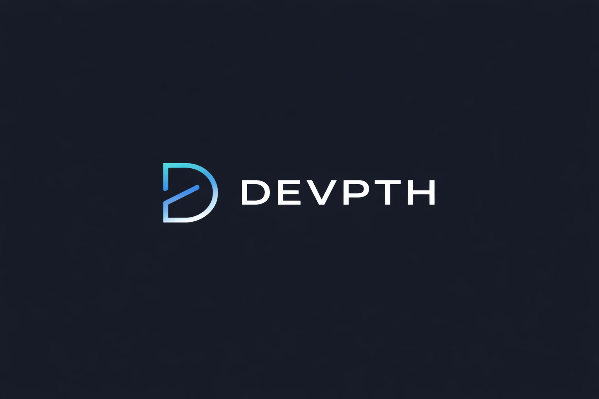

  

  <strong>Transforming how applications are built, deployed, and maintained.</strong> 
  A global-first platform, born to scale worldwide.

---

## 🌍 About Devpth

Devpth is building next-generation software platforms that empower businesses and developers to design, ship, and scale applications faster and more reliably.

Founded with a global vision, Brand focuses on solving real-world engineering and operational challenges with modern, scalable, and thoughtfully designed solutions.

---

## 🚀 Current Status

* 🔧 Actively under development
* 🧪 Early-stage MVP in progress
* 🌐 Built for global adoption from day one

We’re laying the foundation for a platform that will evolve rapidly as we validate ideas, ship features, and learn from real users.

---

## 🧠 Vision

We believe the future of software lies in:

* Simpler developer experiences
* Scalable-by-default architectures
* Thoughtful design across the entire lifecycle

Brand exists to push this future forward.

---

## 📦 What to Expect

* Core platform development
* Open discussions around architecture and design
* Public progress as the product evolves

More details coming soon.

---

## 🔗 Links

* 🌐 Website: Coming soon
* 🌍 Domains: Coming soon
* ✉️ Contact: Coming soon

---

## 🤝 Get Involved

If you’re interested in following the journey, contributing ideas, or collaborating in the future:

⭐ Star this repository
👀 Watch for updates

We’re just getting started.
